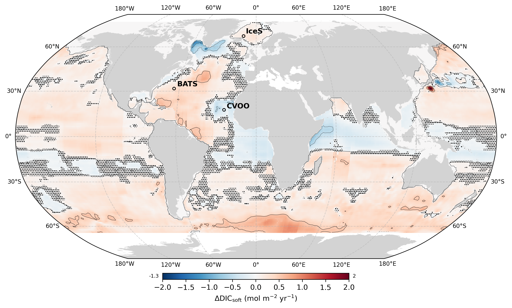

# Ongoing spatial redistribution of a globally stable ocean biological carbon pump
 

This repository includes the raw data and scripts used to analyze and plot this data for the study:

**Ongoing spatial redistribution of a globally stable ocean biological carbon pump**

*L. Delaigue1, 3\*, R. Sauzède3, H. Claustre3, G-J Reichart1,2, M. P. Humphreys1 and O. Sulpis4, 

1Department of Ocean Systems (OCS), NIOZ Royal Netherlands Institute for Sea Research, PO Box 59, 1790 AB Den Burg (Texel), the Netherlands

2Department of Earth Sciences, Utrecht University, Utrecht, the Netherlands

3Laboratoire d’Océanographie de Villefranche (CNRS-SU), 06230 Villefranche-Sur-Mer, France

4CEREGE, Aix Marseille Univ, CNRS, IRD, INRAE, Collège de France, Aix-en-Provence, France

*Corresponding author: Louise Delaigue ([louise.delaigue@imev-mer.fr](mailto:louise.delaigue@imev-mer.fr))*
