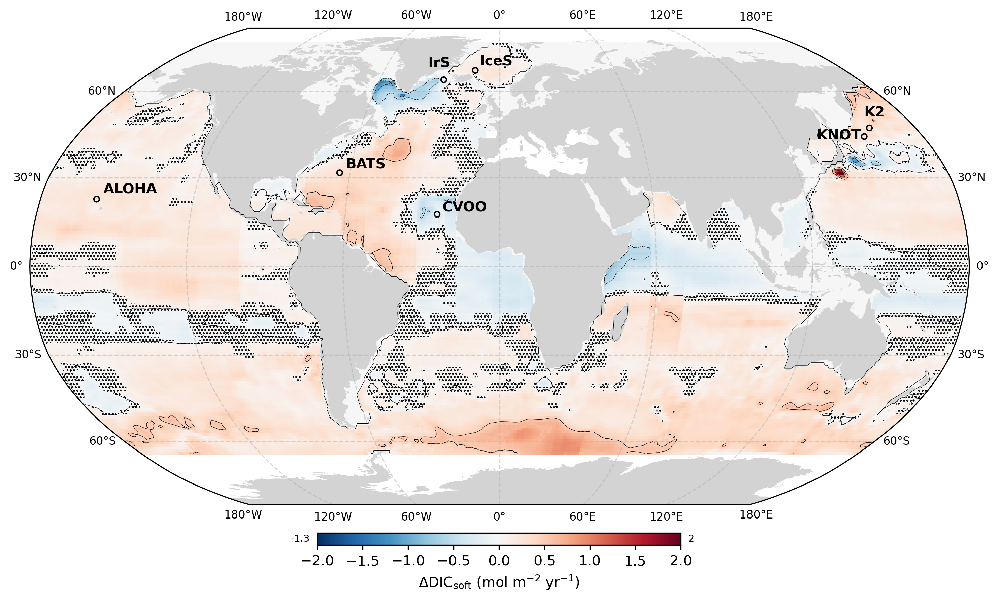

# Ongoing spatial redistribution of a globally stable ocean biological carbon pump

> [!IMPORTANT]  
> This study is currently under review for publication in Nature Geoscience.

#### This repository includes the raw data and scripts used to analyze and plot data for the study:

### **Ongoing spatial redistribution of a globally stable ocean biological carbon pump**

#### *L. Delaigue1, 3\, R. Sauzède3, H. Claustre3, G-J Reichart1,2, M. P. Humphreys1 and O. Sulpis4*

##### 1Department of Ocean Systems (OCS), NIOZ Royal Netherlands Institute for Sea Research, PO Box 59, 1790 AB Den Burg (Texel), the Netherlands

##### 2Department of Earth Sciences, Utrecht University, Utrecht, the Netherlands

##### 3Laboratoire d’Océanographie de Villefranche (CNRS-SU), 06230 Villefranche-Sur-Mer, France

##### 4CEREGE, Aix Marseille Univ, CNRS, IRD, INRAE, Collège de France, Aix-en-Provence, France

###### *Corresponding author: Louise Delaigue ([louise.delaigue@imev-mer.fr](mailto:louise.delaigue@imev-mer.fr))*

## Abstract
The ocean’s dissolved inorganic carbon (DIC) reservoir is a key component of the global carbon cycle. Over recent decades, DIC has increased due to rising anthropogenic CO2, while the biological carbon pump (BCP) — which transfers carbon from the surface to the deep ocean — remains poorly quantified in contribution to DIC changes. Using the novel GOBAI-O2 product and state-of-the-art machine learning algorithms, we reconstructed the global DIC distribution from 2004 to 2022 and decomposed it into DICsoft (BCP contribution), DICcarb (carbonate counter pump), and DICanth (anthropogenic CO2). We report a significant DIC increase, with surface waters rising ~1.0 ± 0.23 μmol kg⁻¹ yr⁻¹, primarily driven by DICanth (>90% of the increase). While DICsoft showed no significant trend globally, we observed strong regional patterns. Climate-driven BCP vertical and horizontal shifts altered carbon sequestration, with some regions subject to enhanced carbon storage at shallower depths (i.e., stored on shorter timescales), while others experienced intensified sequestration at greater depths (i.e., stored on longer timescales). Although this redistribution maintains a near-neutral BCP global trend, locally, strong regional changes could disrupt deep-water ecosystems, carbon storage in the ocean interior, and the BCP long-term role in the Earth's climate regulation. A globally stable but spatially dynamic BCP in response to environmental change may have persisted throughout Earth history and should be considered in sedimentary archives.

## Analysis
A detailed explanation of each script is available in the "Figures and numbers" Jupyter notebook of the repository, along with the resulting figures and statistics. Additionally, interactive plots in Plotly allow for a more detailed exploration of the numbers.

> [!NOTE]  
> This repository does not include the application of the CANYON-B and CONTENT algorithms on the GOBAI-O2 product due to the large file sizes. However, these files can be made available upon request.
